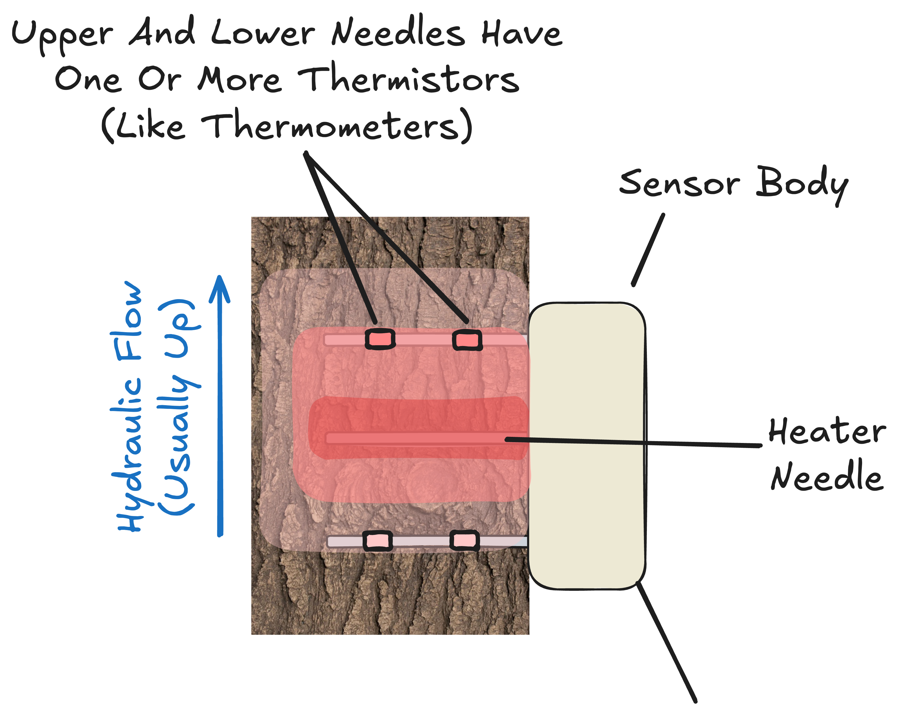

# Gedan Lab Sap Flux Database

This repository provides the necessary tools to store, validate, process, and serve the data produced in the [Gedan Lab's](https://www.gedanlab.com/) sap flux projects.

Here, we document background information, project structure, implementation details, and data particulars.

## Table of Contents

- [Gedan Lab Sap Flux Database](#gedan-lab-sap-flux-database)
  - [Table of Contents](#table-of-contents)
  - [Sap Flux Background, Theory, and Limitations](#sap-flux-background-theory-and-limitations)
    - [Plant Hydraulics](#plant-hydraulics)
    - [Sap Flux As A Metric](#sap-flux-as-a-metric)
    - [Weaknesses and Limitations](#weaknesses-and-limitations)
    - [Optimism On The Horizon For Sap Flux?](#optimism-on-the-horizon-for-sap-flux)
  - [Project Details](#project-details)
    - [Coastal Critical Zone Forest Monitoring](#coastal-critical-zone-forest-monitoring)
    - [Stemflow Experiment](#stemflow-experiment)
  - [Field Setup](#field-setup)
    - [Hardware](#hardware)
      - [Data Loggers](#data-loggers)
      - [Batteries](#batteries)
      - [Sap Flux Sensors](#sap-flux-sensors)
    - [Programs/Firmware](#programsfirmware)
  - [Data Pipeline](#data-pipeline)
    - [Metadata](#metadata)
      - [Calculation Parameters](#calculation-parameters)
      - [Daylight Savings Transitions](#daylight-savings-transitions)
      - [Sensors](#sensors)
      - [The "Deployment"](#the-deployment)
    - [Data](#data)
      - [Raw](#raw)
        - [CR300 New Firmware (firmware 300\_2)](#cr300-new-firmware-firmware-300_2)
        - [CR300 Old Firmware (firmware 300\_1)](#cr300-old-firmware-firmware-300_1)
        - [CR200 New Firmware (firmware 200\_2)](#cr200-new-firmware-firmware-200_2)
        - [CR200 Old Firmware (firmware 200\_1)](#cr200-old-firmware-firmware-200_1)
      - [What We Need From The Raw Data](#what-we-need-from-the-raw-data)
      - [One-Off Fixes](#one-off-fixes)
      - [Daylight Savings Fixer Algorithm](#daylight-savings-fixer-algorithm)
        - [The Problem](#the-problem)
        - [The Solution](#the-solution)
        - [Algorithm Steps](#algorithm-steps)
        - [Critical Assumptions](#critical-assumptions)
    - [Calculations](#calculations)
      - [Theoretical Foundation](#theoretical-foundation)
      - [Calculation Pipeline](#calculation-pipeline)
        - [Step 1: Determine Which Method to Use](#step-1-determine-which-method-to-use)
        - [Step 2: Calculate Heat Velocity (Vh)](#step-2-calculate-heat-velocity-vh)
        - [Step 3: Apply Wound Correction](#step-3-apply-wound-correction)
        - [Step 4: Convert to Sap Flux Density (J)](#step-4-convert-to-sap-flux-density-j)
      - [Implementation Details](#implementation-details)
      - [References for Calculations](#references-for-calculations)
    - [Preparing And Delivering The Data](#preparing-and-delivering-the-data)
      - [Philosophy](#philosophy)
      - [Architecture](#architecture)
      - [Data Access for End Users](#data-access-for-end-users)
      - [Data Validation](#data-validation)
      - [Versioning](#versioning)
      - [Critical Requirements](#critical-requirements)
      - [Migration](#migration)
      - [Deployment](#deployment)

## Sap Flux Background, Theory, and Limitations

### Plant Hydraulics

Sap flux is the rate that water flows through a plant's tissue, usually measured at the stem. It is often measured in $\frac{cm}{hr}$. I find this metric more intuitive if I think of it as the equivalent $\frac{cm^3}{cm^2 \cdot hr}$, that is, the volume of water moved per cross-sectional area of a plant's sapwood per hour.

Water moves through a tree (and through just about anything else) as a function of supply and demand. Soil, plant tissues, and air all have some capacity to be hydrated. We can measure this substrate-specific level of hydration as water potential ($\psi$) in units of pressure, usually bars or megapascals. Negative values of water potential represent tensions that indicate a material is hydraulically unsaturated relative to pure water at atmospheric pressure. The direction and rate of water flow between adjacent materials depends on the water potential gradient ($\Delta\psi$) and the hydraulic conductivity (denoted as $k$ in plant systems).

Sap flux rates, however, should not be understood purely as passive indicators of soil-plant-air hydraulic conditions. Plants actively regulate water flow in response to environmental conditions and physiological needs, much like traders adjusting their strategies based on market conditions. They "assess" the costs and benefits of water expenditure and deploy various behavioral and anatomical regulatory mechanisms accordingly:

**Stomatal regulation**: Plants can close stomata (leaf pores responsible for gas exchange) to reduce water loss when the costs outweigh the benefits. For example, during low-light conditions when photosynthetic carbon gain would be minimal, plants may restrict transpiration to conserve water. See [Sperry 2017](https://doi.org/10.1111/pce.12852), my favorite paper.

**Torus-margo pit closure**: In conifers, specialized valve-like structures between tracheids (water-conducting cells) seal at critical water potential thresholds, preventing air bubbles from spreading through the water transport system and maintaining hydraulic function under stress. See [Pittermann 2005](https://doi.org/10.1126/science.1120479) or anything by [Uwe G. Hacke](https://scholar.google.com/citations?user=Rjs41-EAAAAJ&hl=en&oi=ao).

**Osmotic adjustment**: Plants may accumulate solutes in their tissues to alter water potential gradients and maintain water uptake capacity under drought conditions or varying levels of salinity. See [Munns & Tester 2008](https://doi.org/10.1146/annurev.arplant.59.032607.092911).

The key takeaway is that sap flux is a broadly valuable metric because it integrates information from multiple sources: environmental conditions, plant physiological traits (hydraulic conductivity, vulnerability to cavitation, hydraulic capacity such as sapwood area and leaf area), and plant regulatory strategies (stomatal behavior, risk tolerance, etc.).
However, this integrative nature is both a strength and a limitation. While sap flux can serve as a useful indicator of plant-environment interactions, it cannot reveal on its own which specific factor is driving observed patterns. Because multiple processes influence sap flux simultaneously, meaningful mechanistic insights require combining sap flux estimates with additional empirical observations and/or explicit process modeling to disentangle the relative contributions of environmental, physiological, and behavioral factors.

### Sap Flux As A Metric

The most important thing to understand about sap flux in practice is that it is _not_ a direct measurement. True sap flux measurement requires specialized equipment like flowmeters as in [Sperry 1988](https://doi.org/10.1111/j.1365-3040.1988.tb01774.x), destructive sampling, and controlled laboratory conditions. Sap flux sensors deployed in the field are almost always _temperature sensors_. The values produced by these sensors are _modeled estimates_ of sap flux rates based on measured temperature differences. These estimates can be imprecise—sometimes extremely so. The following section illustrates how temperature measurements are converted into sap flux estimates.

<div align="center">
  
  <p><em>Typical sap flux sensor configuration showing thermistors positioned above and below a heater needle inserted into the sapwood. Temperature differences measured by the thermistors are used to estimate sap flow rates. The red/pink areas are intended to showcase heat distribution a few seconds after the pulse in a typical case, where hydraulic flow (convection) preferentially carries heat up the stem. </em></p>
</div>

Sensors are drilled into the tree's sapwood and left there for months to years. Every 30 to 60 minutes, the sensor introduces a small heat pulse into the wood. The operating principle relies on measuring how this heat moves through the tissue: we know the distance between the heater and thermistor needles, and we measure the time it takes for the heat pulse to travel between them. From this, we can calculate a heat velocity.

> Note that this is just one style of sap flux sensor, usually called "heat pulse" sap flux sensor. There are a few others out there, for example, "continuous heat" sensors that measure persistent changes in heat balance across the thermistors, or "non invasive" sensors that attempt to measure sap flux through bark. Both of these styles have more severe tradeoffs than the heat pulse style (namely, ridiculous power usage in the former and poor measurement resolution in the latter) so I will ignore them for the purposes of this document.

However, transforming heat velocity into sap flux estimates requires addressing a fundamental challenge. Heat moves through wood via two mechanisms: conduction (heat propagating through the solid sapwood matrix) and convection (heat carried by moving water—our target signal). The measured heat velocity represents both processes combined.

To isolate the sap flux component, we apply models that attempt to separate conductive and convective heat transfer. Classically, the field has used the model originally derived in [Marshall 1958](https://doi.org/10.1104/pp.33.6.385), though recent papers like [Kim & Lee 2024](https://doi.org/10.1038/s41598-024-65046-9) have started exploring new methods. This separation is where much of the uncertainty enters our estimates. Current implementations of these models make assumptions about wood properties, sensor geometry, and heat transfer physics that may not hold perfectly in real-world conditions, explaining why sap flux estimates can be substantially imprecise.

### Weaknesses and Limitations

Sap flux estimates face several fundamental limitations that can significantly bias resulting data, especially with current implementation techniques:

**Non-independence of conduction and convection**: The models assume these heat transfer mechanisms can be separated, but they're intrinsically linked. Thermal conductivity depends on sapwood density and water content, both of which vary on multiple timescales. Sapwood density changes seasonally (earlywood/latewood patterns) and annually (growth responses, carbon limitations). More critically, sapwood water content varies diurnally, seasonally, and with plant water status—directly connecting to hydraulic conductivity through vulnerability curves.

This creates a fundamental problem: the conductive component we're trying to "subtract" to isolate convection is itself influenced by the same environmental factors driving sap flux. When researchers study drought effects, for example, both the signal they want to measure (sap flux response) and the background noise they need to account for (changing thermal conductivity) respond to soil moisture—potentially biasing results in systematic ways.

**Probe installation sensitivity**: Heat velocity estimates are extremely sensitive to the distance between heater and thermistor needles. Installation errors as small as 1mm can produce sap flux estimates that are off by up to 70% according to a simulation engine based on Marshall 1958 that I put together. While manufacturers provide drill guides, these typically still allow 1-2mm of misalignment, introducing substantial uncertainty into every measurement.

**Spatial representativeness**: Sap flux sensors measure flow at a single point in the sapwood, but hydraulic conductivity is non-uniformly distributed across a stem's cross-section. Recent annual growth rings typically have higher conductivity than older sapwood, which gradually loses function before converting to non-conductive heartwood. This radial gradient means that a point measurement may not represent the tree's overall water transport.
Converting point measurements (cm/hr at the sensor location) into whole-tree flow estimates requires models of how conductivity varies across the sapwood profile. Some sensors include thermistors at multiple depths to provide empirical profiles of this variation, but even with multiple measurement points, spatial resolution remains quite limited. This uncertainty compounds with the other limitations mentioned above—installation errors and changing thermal properties affect each measurement point differently, making it challenging to construct reliable whole-tree estimates.

**Compounding errors and empirical band-aids**: The limitations described above often produce data that "looks wrong"—sap flux curves may appear shifted up or down relative to expected patterns, with apparently high nighttime flows or other artifacts. Rather than addressing the underlying measurement uncertainties, researchers commonly apply post-hoc "corrections" that introduce additional layers of abstraction.

A typical approach involves "baselining" or "zeroing" data by assuming sap flow equals zero during specific nighttime hours (e.g., 4-7 AM), then subtracting these values from the entire measurement series. This practice is problematic for several reasons:

First, the zero-flow assumption is often violated. Plants may maintain positive flow overnight when soil-plant water potential gradients fail to equilibrate, e.g. rehydrating too slowly or incompletely. Foliar water uptake during humid conditions or precipitation can create reverse flow gradients from leaves toward roots: negative flow that represents real physiological processes, not measurement error.

Second, algorithmic baselining can obscure ecologically relevant signals. In coastal systems, for example, periodic saltwater inundation may induce reverse sap flux events, presumably due to strong solute gradients in the soil. Automatically setting minimum nightly values to zero will both eliminate these signals and bias subsequent daytime estimates. More sophisticated baselining algorithms that filter "outlier" nights based on statistical thresholds make implicit assumptions about event frequency and magnitude, directly constraining a researcher's ability to detect the very phenomena they are studying.

Most critically, these linear corrections attempt to fix fundamentally nonlinear measurement errors. The underlying sources of uncertainty—thermal property variations, probe misalignment, spatial representativeness—interact in complex ways that cannot be addressed by simple offsets.

**The deeper problem**: While sap flux estimates are demonstrably uncertain, the field lacks robust methods for quantifying this uncertainty. Researchers routinely calculate statistics and standard errors across multiple sensors or sites, but virtually never propagate the inherent uncertainty in individual sap flux estimates themselves. We treat modeled estimates as if they were direct measurements, bypassing proper statistical handling of measurement error. This represents a fundamental disconnect between the precision implied by our statistical analyses and the actual reliability of our underlying data.

### Optimism On The Horizon For Sap Flux?

The limitations outlined above—non-independent heat transfer mechanisms, installation sensitivity, and spatial representativeness—all stem from our reliance on external estimates of thermal properties and probe geometry. As part of my PhD thesis, I have developed a new calculation approach that allows us to directly measure probe distances and thermal conductivity from the ΔT data collected by the sensors themselves, addressing several of these fundamental sources of uncertainty.

As of mid-2025, this method remains a theoretical derivation and has not yet been implemented on commercially available sensors. The sap flux data described in this repository were collected using traditional calculation methods and therefore remain subject to all the limitations discussed above. Any downstream applications of these estimates for research or management should carefully consider these uncertainties before drawing conclusions about plant-environment interactions or ecosystem processes.

While the field continues to develop new approaches, current sap flux estimates should be interpreted as valuable but imprecise indicators of plant water use patterns rather than precise measurements of physiological processes.

## Project Details

### Coastal Critical Zone Forest Monitoring

Since 2021, we've monitored sap flux rates across the Delmarva peninsula. We've collected data at three sites:

- The Brownsville Preserve (near Nassawadox, VA)
- Monie Bay National Estuarine Research Reserve (near Princess Anne, MD)
- Milford Neck Wildlife Area (near Milford, DE), though we sunsetted monitoring here in early 2025.

Each of these sites are coastal forests affected by sea level rise. Loblolly Pine (_Pinus taeda_) is the dominant species at each site.

Each site consists of three zones: Low Forest, Mid Forest, and High Forest, where boundaries are demarcated by forest dieback. For example, High Forest trees had healthy canopies at the project outset in 2021, while their Low Forest counterparts had reduced canopies. While the zones are defined ecophysiologically, they broadly covary with elevation and salinity gradients as well, where "High Forest" occurs at the highest elevation and lowest salinity.

Each zone within each site was instrumented with four sap flux sensors split across two plots. Sap flux sensors were installed in _Pinus taeda_ trees with the exception of a brief, relatively unfruitful stint in (mostly dead) _Nyssa sylvatica_ at Brownsville in 2022, clearly demarcated in the dataset.

In total, up to 36 trees were instrumented at a time when the Milford site was active. Sap flux sensors estimated sap flux rates at two depths in the sapwood.

### Stemflow Experiment

Stemflow refers to the portion of precipitation that is intercepted by tree crowns and then channeled down the trunk to reach the forest floor. When it rains, water hits the leaves and branches of trees, and some of that water flows along branches toward the main trunk, then runs down the bark to the base of the tree. This creates a concentrated flow of water around the tree's base.

In collaboration with [researchers at the University of Delaware](https://sites.udel.edu/yochin/), particularly PhD Student Robyn O'Halloran , we're studying this phenomenon via an experiment that excludes stemflow by "catching" it with a collar around a tree's stem on a subset of the trees and subsequently redirecting it into an enormous trash can. The field site is something to behold.

Unlike the forest monitoring project, the Stemflow project is exclusively at the Monie Bay site. We instrumented 6 "moribund" and 6 "healthy" American sweetgum (_Liquidambar styraciflua_) trees at the site. There is no intentional spatial gradient in the design.

## Field Setup

### Hardware

#### Data Loggers

We use Campbell CR200 Series and CR300 series dataloggers. I cannot stress enough how much I **do not recommend doing this**. Please do yourself a favor and get literally any other SDI-12 datalogger if you must use SDI-12. Here are some datalogger caveats that may or may not affect your downstream use case for this dataset or implementation plans for a similar project:

- The speed of the real-time clock is a function of the voltage on the internal coin cell battery. You cannot directly monitor that voltage. If the coin cell battery dips below 3.3V, the clock will run artifically slow compared to real time. You might (correctly) imagine that this is a problem for a time-series dataset. The logger will attempt to keep running on this battery even if it is disconnected from main power for any time (e.g. in a cabinet in the lab, in the field with a dead battery, etc). We had some gnarly clock issues in 2021 until we figured this out. We now replace the logger's internal coin cell battery with a brand new CR2032 during each sensor deployment to ensure that the clock will remain stable. Coupled with other improvements that reduce battery downtime in the field, you can reasonably assume clocks are accurate to within ~5 seconds since 2022.

- In addition, especially early in the monitoring project, faulty clock (internal) batteries and failing main power would give us "time travel" -- sudden jumps across many years of time, sometimes backwards to the unix epoch, sometimes forwards to the other end of the unix epoch, sometimes to a random year in between, and so on. This must be filtered for in the construction of the output dataset from the raw data -- we have no way to figure out what time that was "supposed" to be, as it is nearly ubiquitously accompanied by some sensor downtime before and after. We have no choice but to filter out those data with out-of-range timestamps (e.g. 2021 to present is valid).

- The loggers have no or very limited support for a "low power" mode, and can't supply enough amperage from their "switched power" ports to support the heat pulses for the implexx sensors. This makes it challenging to "turn off" implexx sensors without custom power-switching hardware, which draw an insane ~1 watt each (8 mA @ 12V) at idle between measurement runs.

- The high idle sensor power draw combined with the relatively high (or at least unpredictable -- my lab measurements showed jumps between 2mA @ 12V and 35mA @ 12V) datalogger power draw meant that our stations were pulling much more power than we had initially anticipated. We killed many batteries early in the project, and lost quite a bit of data early on as a result.

- These loggers are not networked or connected to the internet in any way. Radio connectivity draws prohibitively high power for our purposes (solar power limited by overhead forest canopy). This has a critical implication: **our logging stations have no idea about daylight savings time, so we have to adjust timestamps in our processing pipeline**. See the implementation details below if you're curious about how it's handled.

- Solar controllers on these loggers allowed power backflow from the station battery into the panels themselves during low-light conditions and mixed-light conditions. This fried our panels and ruined several batteries. I recommend getting an external MPPT controller if you must use solar. Consider patching in a diode if you must use the Campbell controller.

- Make sure you re-flash the program immediately after you change out the internal clock battery. We've had problems with program corruption before.

- We usually choose to "download new" data into a new file location on each visit. We've found that "download all" is quite slow at 9600 baud on the CR200s, and on occasion weird errors or off-by-one situations that get logged into new data can corrupt old data that has previously been downloaded onto a laptop or tablet. A new file for each "chunk" mitigates the surface for error. This has not always been the case for our downloads, as older downloads may have been taken with "download all".

#### Batteries

We used 12V 8ah sealed lead-acid AGM batteries. Some of the installations for the stemflow project were upgraded to 12V 16ah batteries.

> A note on batteries: a 12V sealed lead-acid battery is fully charged at about 13 volts and completely empty at around 12 volts. Discharge between 13V and 12V is approximately linear. For example, a lead-acid battery at 12.5 volts has roughly 50% of its capacity left. 12.7V is about 70%, and so on. 12.0V is a cliff. There is essentially zero charge left in the battery once it hits 12.0V, so it takes very little power demand to send the battery down towards 0V. Once the battery has sat below 12V for awhile, or below, say, 10V for any amount of time, the battery's capacity to ever hold a full charge again is severely compromised. We learned this the hard way. Further, you should not be too ambitious about the rate at which you recharge these batteries. Using something like a car jumpstarter provides far more amperage than a lead-acid battery can reasonably keep pace with while recharging. Charging too fast will permanently damage your battery. I recommend charging an 8ah 12V battery at only around 1 amp, using a trickle charger that "backs off" its charging voltage and/or amperage when the battery is close to full, something like [this charger](https://www.amazon.com/dp/B082X75Z3M). Leave the battery charging overnight to equilibrate and be kind to your batteries. None of this is true for lithium-ion batteries, which are generally friendlier to work with in controlled settings but haven't performed well for me in outdoor scenarios with large temperature fluctuations.

#### Sap Flux Sensors

We use Implexx sap flux sensors.

During the course of the monitoring project, Implexx changed their sensors' manufactured probe spacing from 0.6cm to 0.8cm -- note that this is already accounted for in the calculations we perform in the data pipeline. Parameters are delivered to each dataset depending on an association with a hardware setup.

The Implexx sensors we use have thermistors at two distinct depths in the sapwood. Early in the project, these depths were not super consistent between installations. Loblolly pines have significant variation in their bark thickness across individuals, and there are a few cases where it appears that a tree has significant "inner" sapwood sap flux and relatively little or no "outer" sapwood sap flux -- the opposite of what you would expect. In reality, these are likely to be cases of inconsistent installations. Since 2023, we've standardized installation depths using a bark scraper like [this one](https://www.mcmaster.com/3645A4/), scraping bark away until we are within a millimeter or two of the cambium before installation. Crucially, if we expose any cambium during the scraping process, we start over and pick a different area of the bark to work from, as exposed/damaged cambium may dry out or alter the characteristics measurement site.

We use the Implexx-provided drill guides and a hand-held dremel to install the sensors. The guides mitigate (but do not eliminate) probe misalignment.

Sensors are installed into metal sleeves (e.g. so we can remove the sensors and the sleeves stay in the drilled holes) and greased according to implexx manufacturer recommendation.

### Programs/Firmware

We initially used SDI-12 measurement programs generated by Campbell Scientific's "Short Cut" software. The exact source code for the firmware we used is in this repository in the folder firmware_source_code. More recently, we've expanded a subset of our installations to record a broader set of measurements and support a flexible number of sensors. This required a new program that Short Cut would not be able to build, so I wrote my own program generator. The [program generator is located on my github](https://github.com/RileyLeff/sapflux_programs) if you'd like to give it a try. You can compile these programs directly on the datalogger, or using my [cross-platform command-line tool](https://github.com/RileyLeff/crbrs).

## Data Pipeline

### Metadata

#### Calculation Parameters

```{toml}
[parameters]
    [parameters.wnd_diam]
    name = "wound diameter"
    def = "diameter of drilled-out hole for probe"
    unit = "cm"
    value = 0.2

    [parameters.sw_gw]
    name = "sapwood green/fresh/wet weight"
    def = "wet weight of a sapwood core"
    unit = "kg"
    value = 0.001

    [parameters.sw_dw]
    name = "sapwood dry weight"
    def = "dry weight of a sapwood core"
    unit = "kg"
    value = 0.005 

    [parameters.k]
    name = "k"
    def = "The rate of diffusion of heat in the wood and sap matrix as calculated from Vandegehuchte & Steppe (2012). "
    unit = "cm^2/s"
    value = 0.002409611

    [parameters.hpd]
    name = "heat pulse duration"
    def = "how long the heater is doing its thing"
    unit = "sec"
    value = 3

    [parameters.woundcorr]
    name = "b"
    def = "some stupid empirical magic number that someone made up and we're all stuck with now"
    unit = "???"
    value = 1.8905

    [parameters.t]
    name = "time since heat pulse emission"
    def = "see name"
    unit = "seconds"
    value = 60

    [parameters.sph]
    name = "seconds per hour"
    def = "see name. rate quantity. super exciting."
    unit = "seconds/hour"
    value = 3600

    [parameters.pd]
    name = "wood density"
    def = "basic density of dry wood"
    unit = "kg/m3"
    value = 500

    [parameters.cd]
    name = "wood matrix specific heat capacity"
    def = ""
    unit = "J/kg/°C at 20 °C"
    value = 1000

    [parameters.mc]
    name = "gravimetric water content of sapwood"
    def = ""
    unit = "kg/kg"
    value = 1

    [parameters.cw]
    name = "specific heat capacity of sap"
    def = ""
    unit = "J/kg/°C at 20 °C"
    value = 4182

    [parameters.pw]
    name = "density of water"
    def = ""
    unit = "kg/m3"
    value = 1000
```

#### Daylight Savings Transitions

Correcting the recorded timestamps to properly account for daylight savings relies on this hard-coded table. Inshallah we will have a better solution to this problem before this table runs dry in 2030:

| action | ts                  |
|--------|---------------------|
| start  | 2011-03-13 3:00:00  |
| start  | 2012-03-11 3:00:00  |
| start  | 2013-03-10 3:00:00  |
| start  | 2014-03-09 3:00:00  |
| start  | 2015-03-08 3:00:00  |
| start  | 2016-03-13 3:00:00  |
| start  | 2017-03-12 3:00:00  |
| start  | 2018-03-11 3:00:00  |
| start  | 2019-03-10 3:00:00  |
| start  | 2020-03-08 3:00:00  |
| start  | 2021-03-14 3:00:00  |
| start  | 2022-03-13 3:00:00  |
| start  | 2023-03-12 3:00:00  |
| start  | 2024-03-10 3:00:00  |
| start  | 2025-03-09 3:00:00  |
| start  | 2026-03-08 3:00:00  |
| start  | 2027-03-14 3:00:00  |
| start  | 2028-03-12 3:00:00  |
| start  | 2029-03-11 3:00:00  |
| start  | 2030-03-10 3:00:00  |
| end    | 2011-11-06 2:00:00  |
| end    | 2012-11-04 2:00:00  |
| end    | 2013-11-03 2:00:00  |
| end    | 2014-11-02 2:00:00  |
| end    | 2015-11-01 2:00:00  |
| end    | 2016-11-06 2:00:00  |
| end    | 2017-11-05 2:00:00  |
| end    | 2018-11-04 2:00:00  |
| end    | 2019-11-03 2:00:00  |
| end    | 2020-11-01 2:00:00  |
| end    | 2021-11-07 2:00:00  |
| end    | 2022-11-06 2:00:00  |
| end    | 2023-11-05 2:00:00  |
| end    | 2024-11-03 2:00:00  |
| end    | 2025-11-02 2:00:00  |
| end    | 2026-11-01 2:00:00  |
| end    | 2027-11-07 2:00:00  |
| end    | 2028-11-05 2:00:00  |
| end    | 2029-11-04 2:00:00  |
| end    | 2030-11-03 2:00:00  |

#### Sensors

We save a lookup table for implexx sensor parameters. Note that thermistor_depth_1_mm is generally called "out" or "outer", while thermistor_depth_2_mm is generally called "in", "inn", or "inner".

| sensor_id   | downstream_probe_distance_cm | upstream_probe_distance_cm | thermistor_depth_1_mm | thermistor_depth_2_mm |
|-------------|------------------------------|----------------------------|-------------------------|-------------------------|
| implexx_old | 0.6                          | 0.6                        | 10                      | 20                      |
| implexx_new | 0.8                          | 0.8                        | 10                      | 20                      |

#### The "Deployment"

The "deployment" is how we match raw data files to their metadata.

A deployment contains all of:

1. A timeframe:
   * Always includes a start time
   * Does not include an end time -- if a new deployment with the same logger ID appears, it supersedes the previous deployment and renders it inactive.
   * Times are specified in UTC, NOT local time.
  
2. A hardware context:
   * Data logger type (CR200, CR300, etc)
   * A data logger ID
   * Data logger firmware version (matches to a raw data schema)
   * A sensor type (e.g. from the sensors table above)
   * An SDI-12 address

3. A measurement context:
   * A tree ID, always
   * Optional notes column
   * e.g. in the monitoring project, a site name, zone name, plot name, tree species
   * e.g. in the stemflow project, a health status, collar presence/absence

It is crucial to note that each project gets its own deployments table, as the exact schema varies project-to-project.

We have a few invariants to enforce in the deployments tables. In software, I generally prefer to follow rust's MISU principle: make invalid states unrepresentable. We should reject invalid deployment states before they can make it into the data.

At the level of a deployment entry, we cannot have:

- An end time before or equal to a start time
- A sensor type that doesn't exist
- An invalid SDI-12 address (must be single-digit alphanumeric e.g. [0-9, a-z, A-Z])
- Missing data for anything except end time or notes.
  - A missing end time signifies an active deployment.

At the level of a deployment table, we cannot have:

- Any [logger id x sdi-12 address] combinations in use in multiple concurrent deployments.

### Data

#### Raw

Raw data can manifest in a couple different formats depending on the deployment configuration.

The files are either named .dat or .csv, but regardless of what they are called, they should always be formatted internally as an ugly .csv.

I strongly prefer extracting information and metadata from the contents of the file (e.g. that weirdly-formatted top row) rather than the filename. The filenames are sometimes incorrect, the weirdly-formatted top row is far more reliable.

Confusingly, the "SapFlwTotX" and "Vh(Out or In)(X)" columns are incorrectly calculated.

We can safely ignore files that contain any of these words in their filename:

```{toml}
forbidden_words_in_datafile_paths = [
    "public", 
    "Public", 
    "status", 
    "Status", 
    "DataTableInfo"
]
```

##### CR300 New Firmware (firmware 300_2)

The A CR300 with new firmware will output raw data that looks like this:

| "TOA5" | "CR300Series_423" | "CR300" | "27025" | "CR300-RF407.Std.10.03" | "CPU:sapflux_3sensor_CR300_30min.cr300" | "39968" | "SapFlowAll" | | | | | | | | | | | | | | | | | | | | | | | | | | | | | | | | | | | | | | | | | | | | | | | | | | | | | | | | |
|---|---|---|---|---|---|---|---|---|---|---|---|---|---|---|---|---|---|---|---|---|---|---|---|---|---|---|---|---|---|---|---|---|---|---|---|---|---|---|---|---|---|---|---|---|---|---|---|---|---|---|---|---|---|---|---|---|---|---|---|---|---|---|---|
| "TIMESTAMP" | "RECORD" | "Batt_volt" | "PTemp_C" | "S0_AlpOut" | "S0_AlpInn" | "S0_BetOut" | "S0_BetInn" | "S0_tMxTout" | "S0_tMxTinn" | "S0_TpDsOut" | "S0_dTDsOut" | "S0_TsDsOut" | "S0_TpUsOut" | "S0_dTUsOut" | "S0_TsUsOut" | "S0_TpDsInn" | "S0_dTDsInn" | "S0_TsDsInn" | "S0_TpUsInn" | "S0_dTUsInn" | "S0_TsUsInn" | "S0_tMxTUsO" | "S0_tMxTUsI" | "S1_AlpOut" | "S1_AlpInn" | "S1_BetOut" | "S1_BetInn" | "S1_tMxTout" | "S1_tMxTinn" | "S1_TpDsOut" | "S1_dTDsOut" | "S1_TsDsOut" | "S1_TpUsOut" | "S1_dTUsOut" | "S1_TsUsOut" | "S1_TpDsInn" | "S1_dTDsInn" | "S1_TsDsInn" | "S1_TpUsInn" | "S1_dTUsInn" | "S1_TsUsInn" | "S1_tMxTUsO" | "S1_tMxTUsI" | "S2_AlpOut" | "S2_AlpInn" | "S2_BetOut" | "S2_BetInn" | "S2_tMxTout" | "S2_tMxTinn" | "S2_TpDsOut" | "S2_dTDsOut" | "S2_TsDsOut" | "S2_TpUsOut" | "S2_dTUsOut" | "S2_TsUsOut" | "S2_TpDsInn" | "S2_dTDsInn" | "S2_TsDsInn" | "S2_TpUsInn" | "S2_dTUsInn" | "S2_TsUsInn" | "S2_tMxTUsO" | "S2_tMxTUsI" |
| "TS" | "RN" | "" | "" | "ratio" | "ratio" | "ratio" | "ratio" | "sec" | "sec" | "degC" | "degC" | "degC" | "degC" | "degC" | "degC" | "degC" | "degC" | "degC" | "degC" | "degC" | "degC" | "sec" | "sec" | "ratio" | "ratio" | "ratio" | "ratio" | "sec" | "sec" | "degC" | "degC" | "degC" | "degC" | "degC" | "degC" | "degC" | "degC" | "degC" | "degC" | "degC" | "degC" | "sec" | "sec" | "ratio" | "ratio" | "ratio" | "ratio" | "sec" | "sec" | "degC" | "degC" | "degC" | "degC" | "degC" | "degC" | "degC" | "degC" | "degC" | "degC" | "degC" | "degC" | "sec" | "sec" |
| "" | "" | "Smp" | "Smp" | "Smp" | "Smp" | "Smp" | "Smp" | "Smp" | "Smp" | "Smp" | "Smp" | "Smp" | "Smp" | "Smp" | "Smp" | "Smp" | "Smp" | "Smp" | "Smp" | "Smp" | "Smp" | "Smp" | "Smp" | "Smp" | "Smp" | "Smp" | "Smp" | "Smp" | "Smp" | "Smp" | "Smp" | "Smp" | "Smp" | "Smp" | "Smp" | "Smp" | "Smp" | "Smp" | "Smp" | "Smp" | "Smp" | "Smp" | "Smp" | "Smp" | "Smp" | "Smp" | "Smp" | "Smp" | "Smp" | "Smp" | "Smp" | "Smp" | "Smp" | "Smp" | "Smp" | "Smp" | "Smp" | "Smp" | "Smp" | "Smp" | "Smp" | "Smp" | "Smp" |
| "2025-05-20 15:00:00" | 0 | 13.1 | 18.93 | 0.2856 | 0.72779 | 0.34219 | 0.64917 | 97.009 | 64.353 | 19.942 | 0.352 | 20.268 | 19.738 | 0.25 | 19.983 | 19.725 | 0.356 | 20.077 | 19.478 | 0.186 | 19.648 | 83.748 | 50.351 | 0.1556 | 0.32474 | 0.17202 | 0.30914 | 81.554 | 64.06 | 17.639 | 0.348 | 17.979 | 17.63 | 0.293 | 17.921 | 17.288 | 0.361 | 17.645 | 17.274 | 0.265 | 17.532 | 74.155 | 58.667 | 0.1106 | -0.00805 | 0.11528 | -0.01195 | 82.275 | 77.264 | 17.097 | 0.303 | 17.393 | 17.042 | 0.27 | 17.307 | 16.737 | 0.251 | 16.985 | 16.668 | 0.254 | 16.918 | 80.88 | 60.397 |
| "2025-05-20 15:30:00" | 1 | 13.1 | 18.28 | 0.20611 | 0.65036 | 0.23144 | 0.62768 | 92.558 | 70.559 | 19.744 | 0.363 | 20.093 | 19.618 | 0.288 | 19.902 | 19.402 | 0.414 | 19.814 | 19.307 | 0.221 | 19.522 | 73.595 | 56.553 | 0.13578 | 0.32906 | 0.15412 | 0.31612 | 90.466 | 67.953 | 17.731 | 0.392 | 18.109 | 17.76 | 0.336 | 18.09 | 17.347 | 0.38 | 17.725 | 17.388 | 0.277 | 17.66 | 81.813 | 59.802 | 0.11813 | 0.0151 | 0.12768 | 0.01856 | 87.082 | 80.299 | 17.211 | 0.342 | 17.543 | 17.185 | 0.301 | 17.48 | 16.802 | 0.271 | 17.069 | 16.761 | 0.266 | 17.024 | 82.645 | 62.171 |
| "2025-05-20 16:00:00" | 2 | 13.09 | 18.9 | 0.25462 | 0.69087 | 0.30382 | 0.67504 | 99.307 | 72.85 | 19.762 | 0.416 | 20.149 | 19.689 | 0.307 | 19.989 | 19.386 | 0.438 | 19.821 | 19.328 | 0.223 | 19.546 | 81.091 | 57.853 | 0.18012 | 0.3563 | 0.2044 | 0.34574 | 89.062 | 67.04 | 18.173 | 0.384 | 18.543 | 18.228 | 0.313 | 18.537 | 17.665 | 0.39 | 18.052 | 17.729 | 0.276 | 18 | 79.902 | 58.633 | 0.13264 | 0.02231 | 0.14896 | 0.033 | 94.522 | 81.903 | 17.589 | 0.354 | 17.927 | 17.58 | 0.305 | 17.876 | 17.111 | 0.277 | 17.383 | 17.073 | 0.268 | 17.339 | 92.365 | 64.78 |
| "2025-05-20 16:30:00" | 3 | 13.09 | 19.81 | 0.2102 | 0.65112 | 0.22984 | 0.65358 | 93.278 | 77.966 | 20.451 | 0.448 | 20.873 | 20.315 | 0.356 | 20.657 | 19.711 | 0.471 | 20.177 | 19.604 | 0.245 | 19.847 | 89.187 | 65.197 | 0.25684 | 0.41184 | 0.28236 | 0.39284 | 92.237 | 66.961 | 18.467 | 0.378 | 18.829 | 18.525 | 0.285 | 18.805 | 17.953 | 0.394 | 18.344 | 18.022 | 0.266 | 18.281 | 80.07 | 58.557 | 0.11165 | 0.0453 | 0.11452 | 0.04472 | 85.377 | 78.338 | 17.921 | 0.268 | 18.186 | 17.904 | 0.239 | 18.141 | 17.42 | 0.274 | 17.691 | 17.38 | 0.262 | 17.639 | 73.584 | 62.235 |
| "2025-05-20 17:00:00" | 4 | 13.1 | 19.64 | 0.11997 | 0.70911 | 0.13384 | 0.69315 | 109.852 | 72.236 | 20.276 | 0.447 | 20.674 | 20.306 | 0.391 | 20.659 | 19.863 | 0.444 | 20.304 | 19.811 | 0.222 | 20.028 | 105.762 | 57.238 | 0.22569 | 0.4244 | 0.25408 | 0.40671 | 98.758 | 66.459 | 18.791 | 0.41 | 19.182 | 18.831 | 0.318 | 19.143 | 18.251 | 0.401 | 18.65 | 18.32 | 0.267 | 18.581 | 92.111 | 58.556 | 0.1753 | 0.05288 | 0.20819 | 0.07642 | 109.924 | 88.682 | 18.454 | 0.431 | 18.852 | 18.412 | 0.35 | 18.746 | 17.848 | 0.299 | 18.139 | 17.794 | 0.277 | 18.07 | 109.289 | 66.234 |

##### CR300 Old Firmware (firmware 300_1)

A CR300 with old firmware will output one or more tables that look like this. **Critically, unlike the new CR300 firmware, which includes multiple sensors in a single file, the old CR300 firmware outputs only one sensor per file -- e.g. each station download consists of 1 or more files**. 

| "TOA5" | "CR300Series_701" | "CR300" | "5033" | "CR300.Std.11.00" | "CPU:CR300_sapflow.CR300" | "32345" | "Table1" | | | | | | |
|---|---|---|---|---|---|---|---|---|---|---|---|---|---|
| "TIMESTAMP" | "RECORD" | "BattV_Min" | "id" | "SDI0" | "SapFlwTot0" | "VhOuter0" | "VhInner0" | "AlphaOut0" | "AlphaIn0" | "BetaOut0" | "BetaIn0" | "tMaxTout0" | "tMaxTin0" |
| "TS" | "RN" | "Volts" | "" | "" | "literPerHour" | "heatVelocity" | "heatVelocity" | "logTRatio" | "logTRatio" | "logTRatio" | "logTRatio" | "second" | "second" |
| "" | "" | "Min" | "Smp" | "Smp" | "Smp" | "Smp" | "Smp" | "Smp" | "Smp" | "Smp" | "Smp" | "Smp" | "Smp" |
| "2025-04-15 10:30:00" | 9684 | 12.93 | 701 | 0 | 0.387 | 5.35 | 5.2 | 0.473 | 0.46 | 0.409 | 0.292 | 49.44 | 41.12 |
| "2025-04-15 11:00:00" | 9685 | 12.91 | 701 | 0 | 0.435 | 6.01 | 5.85 | 0.532 | 0.517 | 0.462 | 0.33 | 46.83 | 40.97 |
| "2025-04-15 11:30:00" | 9686 | 12.91 | 701 | 0 | 0.441 | 6.04 | 5.99 | 0.535 | 0.53 | 0.467 | 0.339 | 47.34 | 40.51 |
| "2025-04-15 12:00:00" | 9687 | 12.91 | 701 | 0 | 0.418 | 5.73 | 5.67 | 0.507 | 0.501 | 0.441 | 0.319 | 48.04 | 41.37 |
| "2025-04-15 12:30:00" | 9688 | 12.91 | 701 | 0 | 0.417 | 5.77 | 5.58 | 0.511 | 0.494 | 0.441 | 0.312 | 48 | 40.92 |
| "2025-04-15 13:00:00" | 9689 | 12.91 | 701 | 0 | 0.432 | 5.95 | 5.81 | 0.527 | 0.514 | 0.456 | 0.329 | 46.66 | 40.81 |
| "2025-04-15 13:30:00" | 9690 | 12.91 | 701 | 0 | 0.462 | 6.36 | 6.24 | 0.563 | 0.552 | 0.487 | 0.353 | 46.11 | 40.67 |
| "2025-04-15 14:00:00" | 9691 | 12.91 | 701 | 0 | 0.436 | 6.04 | 5.84 | 0.534 | 0.517 | 0.454 | 0.322 | 46.99 | 41.14 |
| "2025-04-15 14:30:00" | 9692 | 12.91 | 701 | 0 | 0.36 | 5.06 | 4.7 | 0.448 | 0.416 | 0.369 | 0.252 | 47.98 | 39.81 |
| "2025-04-15 15:00:00" | 9693 | 12.91 | 701 | 0 | 0.332 | 4.65 | 4.36 | 0.412 | 0.386 | 0.336 | 0.233 | 48.79 | 39.39 |
| "2025-04-15 15:30:00" | 9694 | 12.9 | 701 | 0 | 0.305 | 4.26 | 4.04 | 0.377 | 0.358 | 0.307 | 0.214 | 49.26 | 39.86 |

##### CR200 New Firmware (firmware 200_2)

I don't think this one is actually in use quite yet! Here's the code for the datalogger that generally shows the outline of the data schema, which should be quite similar to the firmware 200_1. Like the firmware 300_1, it produces 1 file per sensor.

```{crbasic}
' CR200/CR200X Series
' Program to log standard data from Implexx Sap Flow Sensors
' Generated by Python Script (cr200x_generator.py)
' Number of Sensors: 2
' Measurement Interval: 30 minutes
' NOTE: This program uses one DataTable per sensor.
' CR200X supports a maximum of 8 DataTables with this strategy.

'--- Declare Variables and Units ---
Dim N_0 ' Loop counter for Sensor 0 error handling
Dim N_1 ' Loop counter for Sensor 1 error handling
Public BattV
Public id
Public SDIData_Sensor0(9)
Public SensorAddress0
Public SDIData_Sensor1(9)
Public SensorAddress1

'--- Alias Declarations (Maps array elements to meaningful names) ---
Alias SDIData_Sensor0(1) = SapFlwTot0
Alias SDIData_Sensor0(2) = VhOuter0
Alias SDIData_Sensor0(3) = VhInner0
Alias SDIData_Sensor0(4) = AlphaOut0
Alias SDIData_Sensor0(5) = AlphaIn0
Alias SDIData_Sensor0(6) = BetaOut0
Alias SDIData_Sensor0(7) = BetaIn0
Alias SDIData_Sensor0(8) = tMaxTout0
Alias SDIData_Sensor0(9) = tMaxTin0
Alias SDIData_Sensor1(1) = SapFlwTot1
Alias SDIData_Sensor1(2) = VhOuter1
Alias SDIData_Sensor1(3) = VhInner1
Alias SDIData_Sensor1(4) = AlphaOut1
Alias SDIData_Sensor1(5) = AlphaIn1
Alias SDIData_Sensor1(6) = BetaOut1
Alias SDIData_Sensor1(7) = BetaIn1
Alias SDIData_Sensor1(8) = tMaxTout1
Alias SDIData_Sensor1(9) = tMaxTin1

'--- Units Declarations ---
Units BattV=Volts
Units SapFlwTot0=literPerHour
Units VhOuter0=heatVelocity
Units VhInner0=heatVelocity
Units AlphaOut0=logTRatio
Units AlphaIn0=logTRatio
Units BetaOut0=logTRatio
Units BetaIn0=logTRatio
Units tMaxTout0=second
Units tMaxTin0=second
Units SapFlwTot1=literPerHour
Units VhOuter1=heatVelocity
Units VhInner1=heatVelocity
Units AlphaOut1=logTRatio
Units AlphaIn1=logTRatio
Units BetaOut1=logTRatio
Units BetaIn1=logTRatio
Units tMaxTout1=second
Units tMaxTin1=second

'--- Define Data Tables (One table per sensor due to CR200X field limit) ---
' Note: CR200X dataloggers have a limit of 16 fields per table and 8 tables total.
' DataTable names must be <= 12 characters.
DataTable(Table_S0,True,-1)
	DataInterval(0,30,Min)
	Minimum(1,BattV,False,False)
	Sample(1,id)
	Sample(1,SensorAddress0)
	Sample(1,SapFlwTot0)
	Sample(1,VhOuter0)
	Sample(1,VhInner0)
	Sample(1,AlphaOut0)
	Sample(1,AlphaIn0)
	Sample(1,BetaOut0)
	Sample(1,BetaIn0)
	Sample(1,tMaxTout0)
	Sample(1,tMaxTin0)
EndTable

DataTable(Table_S1,True,-1)
	DataInterval(0,30,Min)
	Minimum(1,BattV,False,False)
	Sample(1,id)
	Sample(1,SensorAddress1)
	Sample(1,SapFlwTot1)
	Sample(1,VhOuter1)
	Sample(1,VhInner1)
	Sample(1,AlphaOut1)
	Sample(1,AlphaIn1)
	Sample(1,BetaOut1)
	Sample(1,BetaIn1)
	Sample(1,tMaxTout1)
	Sample(1,tMaxTin1)
EndTable


'--- Main Program ---
BeginProg
	Scan(30,Min)
		'Default CR200 Series Datalogger Battery Voltage measurement 'BattV'
		Battery(BattV)
		'User Entered Calculation (from example)
		id = Status.PakBusAddress(1,1)
		SensorAddress0 = 0
		SensorAddress1 = 1

		' --- Collect standard data for Sensor 0 (Address "0") ---
		SDI12Recorder(SDIData_Sensor0(), "0M!", 1, 0)
		'Reset all Generic SDI-12 Sensor measurements if NAN is returned to the first element
		If SDIData_Sensor0(1) = NAN Then
			For N_0 = 1 To 9
				SDIData_Sensor0(N_0) = NAN
			Next
		EndIf

		' --- Collect standard data for Sensor 1 (Address "1") ---
		SDI12Recorder(SDIData_Sensor1(), "1M!", 1, 0)
		'Reset all Generic SDI-12 Sensor measurements if NAN is returned to the first element
		If SDIData_Sensor1(1) = NAN Then
			For N_1 = 1 To 9
				SDIData_Sensor1(N_1) = NAN
			Next
		EndIf

		'Call Data Tables and Store Data
		CallTable Table_S0
		CallTable Table_S1
	NextScan
EndProg

```

##### CR200 Old Firmware (firmware 200_1)

One file per table.

| "TOA5" | "CR200Series_305" | "CR200X" | "No_SN" | "CR200X.Std.03" | "Sapflux2sensors1.CR2" | "63887" | "Table2" | | | | | | |
|---|---|---|---|---|---|---|---|---|---|---|---|---|---|
| "TIMESTAMP" | "RECORD" | "BattV_Min" | "id" | "SDI1" | "SapFlwTot1" | "VhOut1" | "VhIn1" | "AlphaOut1" | "AlphaIn1" | "BetaOut1" | "BetaIn1" | "tMaxTout1" | "tMaxTin1" |
| "TS" | "RN" | "Volts" | "" | "" | "unit" | "unit" | "unit" | "unit" | "unit" | "unit" | "unit" | "unit" | "unit" |
| "" | "" | "Min" | "Smp" | "Smp" | "Smp" | "Smp" | "Smp" | "Smp" | "Smp" | "Smp" | "Smp" | "Smp" | "Smp" |
| "2025-01-10 14:00:00" | 12830 | 13.21361 | 305 | 1 | -0.027 | -0.26 | -0.53 | -0.02419 | -0.04761 | -0.03315 | -0.11887 | 56.729 | 48.823 |
| "2025-01-10 14:30:00" | 12831 | 13.0516 | 305 | 1 | -0.03 | -0.29 | -0.6 | -0.02669 | -0.05367 | -0.03575 | -0.11671 | 56.304 | 47.136 |
| "2025-01-10 15:00:00" | 12832 | 13.00878 | 305 | 1 | -0.03 | -0.29 | -0.6 | -0.02679 | -0.05439 | -0.03401 | -0.12053 | 57.695 | 47.528 |
| "2025-01-10 15:30:00" | 12833 | 12.98612 | 305 | 1 | -0.029 | -0.32 | -0.52 | -0.02889 | -0.04659 | -0.03601 | -0.11591 | 58.493 | 47.903 |
| "2025-01-10 16:00:00" | 12834 | 12.98024 | 305 | 1 | -0.03 | -0.3 | -0.58 | -0.02701 | -0.05215 | -0.03417 | -0.12575 | 57.875 | 47.284 |

#### What We Need From The Raw Data

 "TIMESTAMP" | "RECORD" | "Batt_volt" | "PTemp_C" | "S0_AlpOut" | "S0_AlpInn" | "S0_BetOut" | "S0_BetInn" | "S0_tMxTout" | "S0_tMxTinn" | "S0_TpDsOut" | "S0_dTDsOut" | "S0_TsDsOut" | "S0_TpUsOut" | "S0_dTUsOut" | "S0_TsUsOut" | "S0_TpDsInn" | "S0_dTDsInn" | "S0_TsDsInn" | "S0_TpUsInn" | "S0_dTUsInn" | "S0_TsUsInn" | "S0_tMxTUsO" | "S0_tMxTUsI" |

 From the raw data, we need:

- the timestamp
- the record number
- the battery voltage
- and for each sensor (in the case of multi-sensor files) and thermistor depth:
  - alpha (log ratio of temperature changes)
  - beta (log ratio of maximum temperature changes)
  - tmaxT (time it takes for downstream thermistor to reach maximum temp)
  - if available (put an NA if not available):
    - TpDs (avg temperature before heat pulse downstream)
    - dTDs (maximum temperature after heat pulse downstream)
    - TsDs (avg. temperature 60 to 80 seconds after heat pulse downstream)
    - TpUs (avg temperature before heat pulse upstream)
    - dTUs  (maximum temperature after heat pulse upstream)
    - TsUs  (avg. temperature 60 to 80 seconds after heat pulse upstream)

Note that for some reason, missing values can be logged as -99, which is very confusing. Anything that is exactly -99 should be converted to a NA or NAN as appropriate.

#### One-Off Fixes

Here are some examples from the old R library showing one-off fixes and a few other gotchas:

```{r}

#' Fix common problems with the ID column of implexx sap flux data
#' 
#' `fix_id_column` returns a dataframe with a potentially mutated ID column.
#' 
#' @param df A dataframe.
#' @param sdi_col An identifier for the column that contains the sdi address, e.g. 5 (by position) or "sdi" (by name)
#' @return A dataframe.
#' @examples
#' fix_id_column(my_df, "id", "data/raw/cr200_599_cooldata.csv")
fix_id_column <- function(df, id_col) {
        ids_here <- unique(df$id)
    if(length(ids_here) > 1) {
        finite_members <- which(is.finite(ids_here))
        if(length(finite_members) > 1) {
            stop("More than one finite (e.g. a number) logger ID found within a single file")    
        } else if(length(finite_members == 1)){
            df$id <- ids_here[finite_members[1]]
        } else {
            stop("No logger ID found in file:")
        }
    }
    return(df)
}

#' Turn Implexx/Campbell Missing Data Into NAs
#' 
#' `make_missings_NA` returns a dataframe with potentially mutated missing data.
#' 
#' @param df A dataframe.
#' @param cols An identifier for the columns to operate on, e.g. 5 (by position) or "sdi" (by name)
#' @param missingvals A vector of values that indicate missing data, a default is provided for campbell/implexx.
#' @return A dataframe.
#' @examples
#' make_missings_NA(my_df, c(4,5,6))
make_missings_NA <- function(df, cols, missingvals = c(-99, NaN)) {
    for(this_col in cols) {
        replace_these <- which(df[,this_col] %in% missingvals)
        if(length(replace_these) > 0) {
            df[replace_these,this_col] <- NA
        }
    }
    return(df)
}

#' Limit data to a known timeframe to remove points with known clock errors.
#' 
#' `remove_timepoints_outside_of_collection_window` returns a dataframe with a potentially reduced set of rows.
#' 
#' @param df A dataframe.
#' @param timecol An identifier for the column representing time, e.g. 1 (by position) or "ts" (by name). We assume POSIXct format.
#' @param earliest Earliest timestamp allowed in the collection, inclusive. Use POSIXct and mind the timezone.
#' @param latest Latest timestamp allowed in the collection, inclusive. Use POSIXct and mind the timezone.
#' @return A dataframe.
remove_timepoints_outside_of_collection_window <- function(df, timecol, earliest, latest){
    inds_to_keep <- which(
        (df[,timecol] >= earliest) &
        (df[,timecol] <= latest)
    )
    return(df[inds_to_keep,])
}

#' Merges dataframes that originate from the same logger into a single dataframe.  
#' 
#' @param dfs_by_logger A list of dataframes where each entry represents a datalogger. Each entry itself contains a list of dataframes associated with that datalogger.
#' @return A dataframe read from the file located at path.
#' @examples
#' readin_implexx("data/raw/2024_04_17/CR200Series_601_Table1.dat") # returns a dataframe
combine_dfs_by_logger <- function(dfs_by_logger){
    lapply(
        X = dfs_by_logger,
        FUN = \(set_of_dfs) {
            temp <- unique(do.call(rbind, set_of_dfs))
            return(temp[order(temp$ts),])
        }
    )
}

#' Fix one-off problems with files in the input data.
#' 
#' @param df A dataframe.
#' @param path A character (string) that corresponds to the origin of the dataframe.
#' @return A dataframe with potential mutations due to one-off fixes.
#' @examples
#' fix_special_cases(my_df, "data/raw/cr200_wow_this_file_is_messed_up.csv")
fix_special_cases <- function(df, path){
    if(grepl("601", path) & any(is.nan(df$id))){
        df$id <- 601
    }
    
    # special case for logger 501, which thinks it is logger #1
    if(grepl("501", path) & any(df$id == 1)){
        df$id <- 501
    }
    return(df)
}

```

#### Daylight Savings Fixer Algorithm

##### The Problem

Our dataloggers operate on a simple real-time clock that has no concept of daylight savings time (DST). When DST transitions occur, the loggers continue recording timestamps in whatever timezone they were last synchronized to. This creates a complex data management challenge:

1. **No automatic adjustment**: When DST begins (spring forward) or ends (fall back), the logger continues recording in its perceived current timezone
2. **Sporadic synchronization**: Loggers only update their clocks when we visit the field site and manually sync them with our field tablets
3. **Inconsistent visit timing**: Field visits rarely coincide with DST transitions, creating periods where loggers record in the "wrong" timezone
4. **Overlapping downloads**: Our data collection strategy sometimes uses "download new" (just recent data) and other times "download all" (complete history), creating overlapping datasets that must be deduplicated. That is to say, _you cannot take each file's starting timestamp and assume that you have a list of all of the "implied" station visits._ Consider an example where you start a deployment in February, download new in May, download all in June, and download new in August. You would be missing the June visit if you took each file's starting timestamp alone, as the download from June would begin in February, since it includes all data.

This means that some of our data is recorded in EST (UTC-5) when the rest of the US east coast is recording in EDT (UTC-4), or vice versa.

##### The Solution

Our relatively simple algorithm:

1. Identifies unique data "chunks" representing periods between field visits (implied visits)
   
2. Determines the timezone each chunk was recorded as (same time zone through the entire chunk, either EDT or EST based on the first time stamp, the implied visit)
3. Converts all timestamps to UTC from their now-correct timezone for consistent storage and analysis

##### Algorithm Steps

1. **Load and merge raw data files**
   - Track the origin file for each data record
   - Preserve all metadata about download boundaries (e.g. what timestep does each file's contents start and end). Requires first removing the extraneous timepoints outside of the valid time window (Jan 2021 to present), e.g. eliminating data recorded during clock jumps to the unix epoch, etc.

2. **Identify unique chunks**
   - Deduplicate overlapping data from "download all" vs "download new" operations
   - More importantly, identify sets of timestamps that occur in a unique file or combination of files. E.g. for each timestamp, we need to know which files that timestamp occurred in. We can take the unique combinations of origin files as unique chunks. This is even robust to consecutive instances of "download all".

3. **Determine timezone for each chunk**
   - For each chunk, examine the first timestamp
   - Compare against the DST transition table to determine if the logger was in EST or EDT

4. **Convert timestamps to UTC**
   - Be sure to use the correct time zone for each chunk

5. **Validation**
   - Check for missing hours at chunk boundaries (indicates spring DST transition)
   - Check for duplicate hours at chunk boundaries (indicates fall DST transition)
   - Don't fail sensors that were not recording data (e.g. dead battery) at the end of the chunk
   - Flag any chunks that span unexpected time periods after you've already eliminated the dead clock jumps.

##### Critical Assumptions

- All sites operate in US Eastern Time (EST/EDT)
- Field personnel don't manually adjust logger times for DST
- We always sync the clocks on every visit
- The DST transition table remains accurate through 2030

### Calculations

Our sap flux calculations follow the Dual Method Approach with Péclet transition (DMA_Péclet) as described in Forster (2020). This method combines the strengths of two heat pulse approaches to resolve the entire measurement range of sap flux velocities observed in plants.

> The Heat Ratio Method and the TMax method are not actually different methods. They are both derivations of DC Marshall's 1958 model of thermal transfer in sapwood. They just differ in their practical implementation of the same equation.

#### Theoretical Foundation

The Péclet number (Pe) describes the ratio of convection to conduction:
```
Pe = Vh × x / k
```
Where:
- `Vh` = heat velocity (cm/hr)
- `x` = distance between heater and thermistor probes (cm)
- `k` = thermal diffusivity (cm²/s)

#### Calculation Pipeline

##### Step 1: Determine Which Method to Use

Based on thermal equilibrium theory, we use:
- **Heat Ratio Method (HRM)** when Pe ≤ 1 (conduction-dominated, slow flows)
- **Tmax Method** when Pe > 1 (convection-dominated, fast flows)

Since we don't know Vh initially, we use β (beta) as a proxy for Pe:
```
β = ln(ΔTd,max / ΔTu,max)
```

If β ≤ 1, use HRM. If β > 1, use Tmax.

##### Step 2: Calculate Heat Velocity (Vh)

**For HRM (when β ≤ 1):**
```
Vh = (2kα)/(xd + xu) + (xd - xu)/(2(t - t0/2))
```
Where:
- `α` = ln(ΔTd/ΔTu) using temperatures 60-80 seconds post-pulse
- `xd` = downstream probe distance (cm)
- `xu` = upstream probe distance (cm)
- `t` = time since heat pulse (typically 60 seconds)
- `t0` = heat pulse duration (3 seconds for our sensors)

**For Tmax (when β > 1):**
```
Vh = √[(4k/t0) × ln(1 - t0/tm) + xd²] / (tm(tm - t0))
```
Where:
- `tm` = time to maximum temperature in downstream probe (seconds)

##### Step 3: Apply Wound Correction

The insertion of probes disrupts sap flow, requiring correction:
```
Vc = aVh + bVh² + cVh³
```

Wound correction coefficients (a, b, c) depend on:
- Wound diameter (measured at end of deployment)
- Probe spacing
- Species-specific factors

For our Implexx sensors with typical wound diameters of 2.0-2.4 mm:
- Use coefficients from Burgess et al. (2001) Table 2
- Or calculate using the Swanson & Whitfield (1981) numerical model

##### Step 4: Convert to Sap Flux Density (J)

```
J = Vc × ρd × (cd + mc × cw) / (ρw × cw)
```
Where:
- `ρd` = sapwood dry density (kg/m³)
- `cd` = specific heat capacity of dry wood (1200 J/kg/K)
- `mc` = gravimetric water content of sapwood (kg/kg)
- `cw` = specific heat capacity of water (4182 J/kg/K)
- `ρw` = density of water (1000 kg/m³)

Result: J in cm³/cm²/hr (equivalent to cm/hr)

#### Implementation Details

1. **Thermal Diffusivity (k)**: Calculate using the Vandegehuchte & Steppe (2012a) method:
   ```
   k = K/(ρc)
   ```
   Where K is thermal conductivity and ρc is volumetric heat capacity of the wood-water matrix. Note that this is a different K from the hydraulic conductivity k discussed earlier in the document. Plant hydraulics researchers ran out of letters at some point, unfortunately.

2. **Missing Values**: Convert any -99 values from the logger to NA before calculations.

3. **Quality Control**: 
   - HRM becomes unreliable when heat velocity exceeds ~15 cm/hr (varies with k)
   - Tmax cannot resolve velocities below ~10 cm/hr
   - The DMA_Péclet approach automatically handles this transition

#### References for Calculations

- Marshall DC (1958) - Original heat pulse equations
- Burgess et al. (2001) - Wound correction coefficients
- Vandegehuchte & Steppe (2012a) - Thermal diffusivity calculations
- Forster MA (2020) - Dual Method Approach with Péclet transition

### Preparing And Delivering The Data

#### Philosophy

All scientific data will be preserved in its original, unmodified form. Any transformations, corrections, or derived calculations will be implemented as explicit, versioned code that operates on immutable source data. This ensures complete reproducibility and allows future researchers to audit or improve upon our methods.

#### Architecture

The data platform consists of:

- **Rust Core Library**: Built on `tokio` and `axum`, providing async HTTP APIs for all data operations. Uses `sqlx` for type-safe database queries and `thiserror` for ergonomic error handling
- **PostgreSQL Database**: 
  - Raw CSV files stored as validated BLOBs
  - Structured metadata with enforced invariants
  - Complete version history with CalVer identifiers (YYYY.MM.DD.N)
- **CLI Tool**: Rust binary for bulk operations, data import/export, and administrative tasks
- **Web Interface**: Svelte 5 SPA with Clerk authentication, providing controlled access to manage projects, validate deployments, and export versioned datasets
- **Distribution Format**: Parquet files with all timestamps in UTC, providing efficient columnar storage with embedded metadata

#### Data Access for End Users

The public-facing website features a straightforward download interface:
- **One button per project**: "Download Stemflow Dataset" and "Download Monitoring Dataset"
- **Version selection**: Simple dropdown menu showing available versions (e.g., "2024.03.15.1 (latest)", "2024.02.28.1", etc.)
- **Direct download**: Click download, receive the complete Parquet file for that project version
- **No filtering**: Full datasets only - analysis and subsetting happen in the user's tools of choice

Each project's data is packaged separately, maintaining clear boundaries between stemflow measurements and continuous monitoring data.

#### Data Validation

Raw data must pass validation before storage:
- CSV format compliance (headers, column count, data types)
- Sensor serial numbers match registered devices
- Deployment periods don't overlap for the same sensor
- Location coordinates are valid
- All timestamps can be parsed and converted to UTC

Validation is implemented using Rust's type system with `serde` validators and `TryFrom` implementations that enforce these invariants at compile time.

#### Versioning
Data releases follow Calendar Versioning (CalVer):
- Format: `YYYY.MM.DD.N` (e.g., `2024.03.15.1`)
- Each version is an immutable snapshot
- Multiple releases per day increment the final digit
- All historical versions remain accessible via the API

#### Critical Requirements
- **UTC Everywhere**: All timestamps in stored data and exported Parquet files use UTC
- **Immutable History**: Raw data files are never modified after initial validation and storage
- **Type Safety**: Domain invariants enforced through Rust's type system
- **Audit Trail**: Every change tracked with user, timestamp, and rationale

#### Migration
Existing data will be imported using PEP 723-compliant Python scripts (managed with `uv`) that:
1. Validate CSV structure and content
2. Convert all timestamps to UTC
3. Check deployment consistency
4. Upload via authenticated API calls

#### Deployment
Hosted on Render.io with:
- Web service running the Axum API and Svelte frontend
- Managed PostgreSQL with automatic backups
- Clerk for authentication and user management
- Persistent disk storage for reliability
